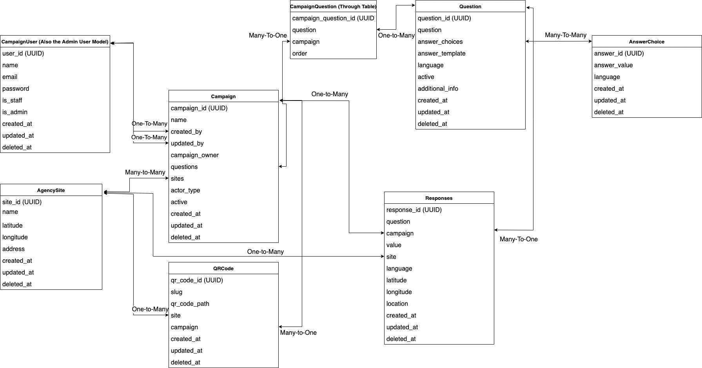

# C4GFoodBank
C4G Food Bank Client Survey

[WebPage](https://prateek05.github.io/C4GFoodBank/)

# Food Bank Quality Survey Django Application

## Introduction

This is a Python Django Survey application, which is dockerized to ensure consistency between systems.

## Dependencies

- Docker
- Docker-compose
- GNU Make
- If a file will not save without root access run `sudo chown -R $USER .`

## Techologies Used

- Python
- Nginx
- Make
- Docker
- Postgres

## Links to Know

- Local Frontend address: http://localhost
- Local Backend address: http://localhost:8000
- Swagger docs: http://localhost:8000/openapi/
- Local Admin Portal: http://localhost:8000/admin/
- Survey Routes: http://localhost:8000/survey/{campaign_id}/{site_id}

## Data Model

## Useful Commands (Need to run these commands at the project root)

- `make build` - Runs through the applications entire setup process
- `make init` - Creates the containers and installs dependencies
- `make start` - Starts a detached instance of the containers
- `make lint` - Lints the backend
- `make init` - Creates the containers and installs dependencies
- `make test` - Tests the backend
- `make migrate` - Runs any outstanding database migrations
- `make migrations` - Creates any new model change migrations
- `make stop` - Stops and removes the containers
- `make install` - Installs python dependencies
- `make logs` - View django app docker logs
- `make seed` - Seeds database

## Important Files

- `app/campaigns/models` - Holds the campaign specific models
- `app/campaigns/admin` - Registers the models to admin portal
- `app/campaigns/signals` - Signals to handle post save model updates
- `app/views/signals` - Holds the route definitions
- `app/food_bank_survey/settings` - Holds the django app's settings
- `app/food_bank_survey/url` - API routes are registered
- `app/django_static` - Holds the static content for the admin and swagger sites
- `app/scripts` - Holds script files (Uses the runscript package)
- `app/users` - Holds the user and agency site files

## Admin Features

- `Filtering`
- `Campaign Question Ordering`
- `Response Exporting` The delimiter is a `|`
- `Question, Campaign, Answer Choice Importing` The delimiter is a `|`
